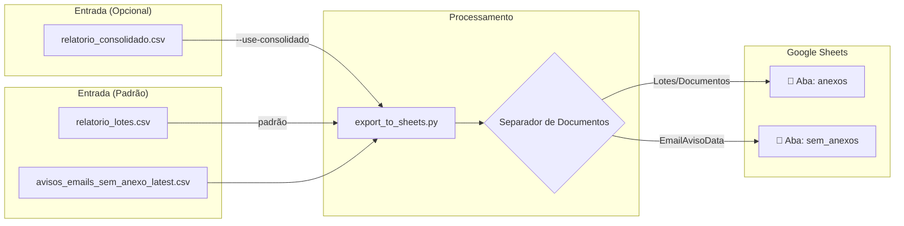

# Exportação para Google Sheets

Este guia documenta o sistema de exportação de documentos processados para o Google Sheets, introduzido na v0.3.x.

## Visão Geral

O sistema de exportação para Google Sheets separa documentos em **duas abas distintas**:

| Aba          | Conteúdo                                 | Fonte de Dados                       |
| :----------- | :--------------------------------------- | :----------------------------------- |
| `anexos`     | Documentos com anexo (lotes processados) | `relatorio_lotes.csv` (padrão)       |
| `sem_anexos` | E-mails sem anexo (apenas links)         | `avisos_emails_sem_anexo_latest.csv` |

### Fontes de Dados

O sistema suporta **duas fontes de dados** para a aba `anexos`:

| Modo                | CSV                         | Estrutura               | Uso Recomendado                      |
| :------------------ | :-------------------------- | :---------------------- | :----------------------------------- |
| **Padrão**          | `relatorio_lotes.csv`       | 1 linha por e-mail/lote | ✅ Mais simples, visão por lote      |
| `--use-consolidado` | `relatorio_consolidado.csv` | 1 linha por documento   | Detalhado, múltiplos docs por e-mail |



---

## Configuração

### 1. Criar Service Account no Google Cloud

1. Acesse o [Google Cloud Console](https://console.cloud.google.com/)
2. Crie um novo projeto ou selecione um existente
3. Ative a **Google Sheets API**:
    - Menu → APIs e Serviços → Biblioteca
    - Busque "Google Sheets API" e clique em "Ativar"
4. Crie uma **Service Account**:
    - Menu → APIs e Serviços → Credenciais
    - Criar credenciais → Conta de serviço
    - Preencha o nome e clique em "Criar"
5. Baixe o arquivo JSON de credenciais:
    - Clique na conta de serviço criada
    - Aba "Chaves" → Adicionar chave → Criar nova chave → JSON
    - Salve como `credentials.json` na raiz do projeto

### 2. Compartilhar a Planilha

1. Crie uma planilha no Google Sheets ou use uma existente
2. Copie o e-mail da Service Account (campo `client_email` no `credentials.json`)
3. Compartilhe a planilha com esse e-mail (permissão de Editor)

### 3. Configurar Variáveis de Ambiente

Adicione ao seu arquivo `.env`:

```bash
# ID da planilha (extraído da URL)
# Ex: https://docs.google.com/spreadsheets/d/1ABC.../edit → ID = 1ABC...
GOOGLE_SPREADSHEET_ID=sua_spreadsheet_id_aqui

# Caminho para o arquivo de credenciais (opcional, default: credentials.json)
GOOGLE_CREDENTIALS_PATH=credentials.json
```

---

## Uso

### Via Linha de Comando

```bash
# Testar sem enviar dados (dry-run) - usa relatorio_lotes.csv por padrão
python scripts/export_to_sheets.py --dry-run

# Exportar para Google Sheets (modo padrão - relatorio_lotes.csv)
python scripts/export_to_sheets.py

# Usar modo detalhado (relatorio_consolidado.csv)
python scripts/export_to_sheets.py --use-consolidado

# Especificar ID da planilha
python scripts/export_to_sheets.py --spreadsheet-id "1ABC..."

# Usar arquivo de credenciais diferente
python scripts/export_to_sheets.py --credentials /path/to/credentials.json

# Especificar CSVs de entrada customizados
python scripts/export_to_sheets.py --csv-lotes path/to/lotes.csv
python scripts/export_to_sheets.py --csv-avisos path/to/avisos.csv

# Modo consolidado com CSV customizado
python scripts/export_to_sheets.py --use-consolidado \
    --csv-consolidado data/output/relatorio_consolidado.csv
```

### Opções CLI

| Opção               | Descrição                                                         |
| :------------------ | :---------------------------------------------------------------- |
| `--dry-run`         | Simula exportação sem enviar dados                                |
| `--use-consolidado` | Usa `relatorio_consolidado.csv` ao invés de `relatorio_lotes.csv` |
| `--csv-lotes`       | Caminho customizado para CSV de lotes                             |
| `--csv-consolidado` | Caminho customizado para CSV consolidado                          |
| `--csv-avisos`      | Caminho customizado para CSV de avisos                            |
| `--spreadsheet-id`  | ID da planilha do Google Sheets                                   |
| `--credentials`     | Caminho para `credentials.json`                                   |
| `--batch-size`      | Linhas por batch (default: 100)                                   |

### Via Python

```python
from pathlib import Path
from scripts.export_to_sheets import (
    GoogleSheetsExporterDualTab,
    load_lotes_from_csv,      # Novo! Carrega do relatorio_lotes.csv
    load_documents_from_csv,   # Carrega do relatorio_consolidado.csv
    load_avisos_from_csv,
)

# MODO PADRÃO: Carregar do relatorio_lotes.csv (recomendado)
lotes = load_lotes_from_csv(Path("data/output/relatorio_lotes.csv"))
avisos = load_avisos_from_csv(Path("data/output/avisos_emails_sem_anexo_latest.csv"))
all_docs = lotes + avisos

# MODO DETALHADO: Carregar do relatorio_consolidado.csv
# docs = load_documents_from_csv(Path("data/output/relatorio_consolidado.csv"))
# avisos = load_avisos_from_csv(Path("data/output/avisos_emails_sem_anexo_latest.csv"))
# all_docs = docs + avisos

# Exportar
exporter = GoogleSheetsExporterDualTab(
    spreadsheet_id="sua_spreadsheet_id",
    credentials_path="credentials.json"
)

qtd_anexos, qtd_sem_anexos = exporter.export(all_docs)
print(f"Exportados: {qtd_anexos} anexos, {qtd_sem_anexos} sem_anexos")
```

---

## Mapeamento de Colunas

### Aba `anexos`

#### Modo Padrão (`relatorio_lotes.csv`)

Uma linha por e-mail/lote processado:

| Coluna         | Campo Origem                     | Descrição                             |
| :------------- | :------------------------------- | :------------------------------------ |
| **DATA**       | `batch_id` (extraído)            | Data de processamento (DD/MM/YYYY)    |
| **ASSUNTO**    | `email_subject`                  | Assunto do e-mail de origem           |
| **N_PEDIDO**   | -                                | Vazio (reservado para futuro)         |
| **EMPRESA**    | `empresa`                        | Empresa destinatária (CSC, MOC, etc.) |
| **VENCIMENTO** | `vencimento`                     | Data de vencimento (DD/MM/YYYY)       |
| **FORNECEDOR** | `fornecedor`                     | Nome/Razão Social do fornecedor       |
| **NF**         | `numero_nota`                    | Número da NF                          |
| **VALOR**      | `valor_boleto` ou `valor_compra` | Valor em R$                           |
| **SITUACAO**   | `status_conciliacao`             | Status: OK, DIVERGENTE, CONFERIR      |
| **AVISOS**     | `divergencia`                    | Alertas e divergências                |

#### Modo Detalhado (`--use-consolidado`)

Para documentos individuais (`InvoiceData`, `DanfeData`, `BoletoData`, `OtherDocumentData`):

| Coluna         | Campo Origem                       | Descrição                             |
| :------------- | :--------------------------------- | :------------------------------------ |
| **DATA**       | `data_processamento`               | Data de processamento (DD/MM/YYYY)    |
| **ASSUNTO**    | `source_email_subject`             | Assunto do e-mail de origem           |
| **N_PEDIDO**   | -                                  | Vazio (reservado para futuro)         |
| **EMPRESA**    | `empresa`                          | Empresa destinatária (CSC, MOC, etc.) |
| **VENCIMENTO** | `vencimento`                       | Data de vencimento (DD/MM/YYYY)       |
| **FORNECEDOR** | `fornecedor_nome`                  | Nome/Razão Social do fornecedor       |
| **NF**         | `numero_nota` / `numero_documento` | Número da NF ou documento             |
| **VALOR**      | `valor_total` / `valor_documento`  | Valor em R$                           |
| **SITUACAO**   | Calculado                          | Status: OK, DIVERGENTE, VENCIDO, etc. |
| **AVISOS**     | Calculado                          | Alertas concatenados                  |

### Aba `sem_anexos`

Para e-mails sem anexo (`EmailAvisoData`):

| Coluna         | Campo Origem                                  | Descrição                          |
| :------------- | :-------------------------------------------- | :--------------------------------- |
| **DATA**       | `data_processamento`                          | Data de processamento (DD/MM/YYYY) |
| **ASSUNTO**    | `source_email_subject` / `email_subject_full` | Assunto do e-mail                  |
| **N_PEDIDO**   | -                                             | Vazio (reservado para futuro)      |
| **EMPRESA**    | `empresa`                                     | Empresa destinatária               |
| **FORNECEDOR** | `fornecedor_nome`                             | Nome do fornecedor/remetente       |
| **NF**         | `numero_nota`                                 | Número da NF extraído do link      |
| **LINK**       | `link_nfe`                                    | URL do portal de NF-e              |
| **CÓDIGO**     | `codigo_verificacao`                          | Código de verificação da NF        |

---

## Lógica de Situação e Avisos

O sistema calcula automaticamente a situação de cada documento baseado em:

### Regras de Divergência

| Condição            | Situação     | Aviso Gerado                              |
| :------------------ | :----------- | :---------------------------------------- |
| NF vazia ou nula    | `DIVERGENTE` | `[DIVERGENTE] Campos faltando: NF`        |
| Valor = 0 ou nulo   | `DIVERGENTE` | `[DIVERGENTE] Campos faltando: VALOR`     |
| NF e Valor faltando | `DIVERGENTE` | `[DIVERGENTE] Campos faltando: NF, VALOR` |

### Regras de Vencimento

| Condição                 | Situação             | Aviso Gerado                                   |
| :----------------------- | :------------------- | :--------------------------------------------- |
| Vencimento passado       | `VENCIDO`            | `[VENCIDO] Vencimento em DD/MM/YYYY`           |
| Menos de 4 dias úteis    | `VENCIMENTO_PROXIMO` | `[URGENTE] Apenas X dias úteis até vencimento` |
| Vencimento não informado | `CONFERIR`           | `[CONFERIR] Vencimento não informado`          |

!!! note "Cálculo de Dias Úteis"
O sistema usa o calendário de São Paulo (`config/feriados_sp.py`) para calcular dias úteis, considerando:

    - Finais de semana (sábado e domingo)
    - Feriados nacionais
    - Feriados estaduais de SP
    - Feriados municipais de São Paulo capital (Aniversário da cidade, Consciência Negra)
    - Carnaval e Corpus Christi

### Concatenação de Avisos

O campo AVISOS concatena múltiplos alertas separados por `|`:

```
[DIVERGENTE] | [DIVERGENTE] Campos faltando: NF | [VENCIDO] Vencimento em 03/11/2025
```

---

## Métodos Adicionados aos Modelos

### `to_anexos_row()`

Disponível em: `InvoiceData`, `DanfeData`, `BoletoData`, `OtherDocumentData`

```python
from core.models import InvoiceData

invoice = InvoiceData(
    arquivo_origem="nota.pdf",
    data_processamento="2026-01-09",
    empresa="CSC",
    fornecedor_nome="ACME LTDA",
    numero_nota="12345",
    valor_total=1500.50,
    vencimento="2026-01-15",
    source_email_subject="[FATURA] Nota Fiscal",
)

row = invoice.to_anexos_row()
# ['09/01/2026', '[FATURA] Nota Fiscal', '', 'CSC', '15/01/2026', 'ACME LTDA', '12345', 1500.5, 'OK', '[OK] | [URGENTE] Apenas 3 dias úteis até vencimento']
```

### `to_sem_anexos_row()`

Disponível em: `EmailAvisoData`

```python
from core.models import EmailAvisoData

aviso = EmailAvisoData(
    arquivo_origem="email_123",
    data_processamento="2026-01-09",
    empresa="RBC",
    fornecedor_nome="Movidesk",
    numero_nota="193866",
    link_nfe="https://nfe.prefeitura.sp.gov.br/nfe.aspx?ccm=1234",
    codigo_verificacao="ABC123",
    email_subject_full="ENC: Movidesk - NFS-e + Boleto",
)

row = aviso.to_sem_anexos_row()
# ['09/01/2026', 'ENC: Movidesk - NFS-e + Boleto', '', 'RBC', 'Movidesk', '193866', 'https://nfe.prefeitura.sp.gov.br/nfe.aspx?ccm=1234', 'ABC123']
```

---

## Classe GoogleSheetsExporterDualTab

### Construtor

```python
GoogleSheetsExporterDualTab(
    credentials_path: str = None,      # Caminho para credentials.json
    spreadsheet_id: str = None,        # ID da planilha
    dry_run: bool = False              # Modo simulação
)
```

### Métodos

#### `export(documents, batch_size=100, source_email_subject_map=None)`

Exporta documentos para as duas abas.

```python
exporter = GoogleSheetsExporterDualTab(spreadsheet_id="1ABC...")

qtd_anexos, qtd_sem_anexos = exporter.export(
    documents=all_docs,
    batch_size=100,
    source_email_subject_map=None  # Opcional: {batch_id: email_subject}
)
```

**Parâmetros:**

| Parâmetro                  | Tipo                 | Descrição                        |
| :------------------------- | :------------------- | :------------------------------- |
| `documents`                | `List[DocumentData]` | Lista de documentos a exportar   |
| `batch_size`               | `int`                | Linhas por batch (default: 100)  |
| `source_email_subject_map` | `dict`               | Mapa opcional batch_id → subject |

**Retorno:** `Tuple[int, int]` - (quantidade_anexos, quantidade_sem_anexos)

#### `separate_documents(documents)`

Separa documentos em dois grupos.

```python
anexos, sem_anexos = exporter.separate_documents(documents)
```

---

## Tratamento de Erros

### Retry Automático

O exportador implementa retry com exponential backoff para lidar com rate limits da API do Google Sheets:

- Máximo de 5 tentativas
- Tempo entre tentativas: 2^n segundos (2s, 4s, 8s, 16s, 32s)

### Erros Comuns

| Erro                                    | Causa                        | Solução                                     |
| :-------------------------------------- | :--------------------------- | :------------------------------------------ |
| `GOOGLE_SPREADSHEET_ID não configurado` | Variável de ambiente ausente | Adicione ao `.env`                          |
| `Arquivo de credenciais não encontrado` | `credentials.json` ausente   | Baixe do Google Cloud Console               |
| `APIError 403`                          | Planilha não compartilhada   | Compartilhe com o e-mail da Service Account |
| `APIError 429`                          | Rate limit excedido          | Aumente o batch_size ou aguarde             |

---

## Exemplo Completo

```python
#!/usr/bin/env python3
"""Exemplo de exportação completa para Google Sheets."""

import os
import sys
from pathlib import Path

# Adiciona raiz do projeto ao path
sys.path.insert(0, str(Path(__file__).resolve().parent.parent))

from dotenv import load_dotenv
load_dotenv()

from scripts.export_to_sheets import (
    GoogleSheetsExporterDualTab,
    load_lotes_from_csv,       # Modo padrão (recomendado)
    load_documents_from_csv,   # Modo detalhado
    load_avisos_from_csv,
)

def main():
    # Caminhos dos CSVs
    base_dir = Path(__file__).resolve().parent.parent
    csv_lotes = base_dir / "data/output/relatorio_lotes.csv"
    csv_avisos = base_dir / "data/output/avisos_emails_sem_anexo_latest.csv"

    # Carrega documentos (modo padrão - relatorio_lotes.csv)
    print("📂 Carregando lotes...")
    docs_anexos = load_lotes_from_csv(csv_lotes)
    docs_avisos = load_avisos_from_csv(csv_avisos)

    all_docs = docs_anexos + docs_avisos
    print(f"   Total: {len(all_docs)} documentos")

    # Verifica configuração
    spreadsheet_id = os.getenv("GOOGLE_SPREADSHEET_ID")
    if not spreadsheet_id:
        print("❌ GOOGLE_SPREADSHEET_ID não configurado!")
        return 1

    # Exporta
    print("📤 Exportando para Google Sheets...")
    exporter = GoogleSheetsExporterDualTab(
        spreadsheet_id=spreadsheet_id,
        credentials_path="credentials.json"
    )

    try:
        qtd_anexos, qtd_sem_anexos = exporter.export(all_docs, batch_size=50)
        print(f"✅ Exportação concluída!")
        print(f"   📎 Anexos: {qtd_anexos}")
        print(f"   🔗 Sem Anexos: {qtd_sem_anexos}")
        return 0

    except Exception as e:
        print(f"❌ Erro: {e}")
        return 1

if __name__ == "__main__":
    sys.exit(main())
```

---

## Integração com Pipeline

O script de exportação pode ser integrado ao pipeline principal:

```bash
# Pipeline completo (modo padrão - relatorio_lotes.csv)
python run_ingestion.py              # Processa e-mails
python scripts/export_to_sheets.py   # Exporta para Sheets

# Pipeline com modo detalhado
python run_ingestion.py
python scripts/export_to_sheets.py --use-consolidado
```

Ou automatizado via cron/agendador:

```bash
# Crontab (Linux/Mac) - modo padrão
0 8 * * 1-5 cd /path/to/scrapper && python run_ingestion.py && python scripts/export_to_sheets.py
```

---

## Histórico de Alterações

### v0.3.1 (Janeiro 2026)

- **BREAKING**: Fonte padrão alterada de `relatorio_consolidado.csv` para `relatorio_lotes.csv`
- Nova função `load_lotes_from_csv()` para carregar do relatório de lotes
- Nova flag `--use-consolidado` para usar o modo detalhado anterior
- Nova flag `--csv-lotes` para especificar CSV de lotes customizado
- Melhoria na integração: CSVs de avisos agora compatíveis com formato esperado
- Campos adicionais salvos nos parciais para reconstrução completa

---

## Ver Também

- [API: Core Models](../api/core.md) - Documentação dos modelos de dados
- [API: Services](../api/services.md) - Serviços de ingestão
- [Guia de Ingestão](ingestion.md) - Configuração de e-mail
- [Conformidade PAF](../conformidade_paf.md) - Políticas e procedimentos
